# UML Diagrams — Civilian Complaint Portal

> **Project:** Miniproject_java — OOP Assignment (JavaFX)
> **Diagrams covered:** Structural (Class, Object, Component, Package) + Behavioral (Use Case, Sequence ×3, Activity, State Machine)

---

## 📐 STRUCTURAL DIAGRAMS

---

### 1. Class Diagram

> Shows all classes, their attributes, methods, and relationships (inheritance, association, dependency, generics).

```mermaid
classDiagram
    %% ─── ENUMS ───────────────────────────────────────────────────────────────
    class Role {
        <<enumeration>>
        CITIZEN
        OFFICER
        ADMIN
    }

    class Status {
        <<enumeration>>
        FILED
        UNDER_REVIEW
        ESCALATED
        RESOLVED
        REJECTED
    }

    class OfficerDepartment {
        <<enumeration>>
        ACB
        MSEB
        PWD
        LOCAL_POLICE
        MUNICIPAL_CORPORATION
        TRAFFIC_POLICE
    }

    class ComplaintCategory {
        <<enumeration>>
        INFRASTRUCTURE
        CORRUPTION
        NOISE
        TRAFFIC
        SANITATION
        WATER_SUPPLY
        ELECTRICITY
    }

    %% ─── USER HIERARCHY ──────────────────────────────────────────────────────
    class BaseUser {
        <<abstract>>
        +int userId
        +String username
        +String password
        +Role role
        +login(String, String) boolean
        +performAction()* void
    }

    class Citizen {
        -CitizenProfile profile
        +performAction() void
        +fileComplaint(T, ComplaintBox~T~) void
        +viewProfile(Admin) String
        +getProfile() CitizenProfile
    }

    class Officer {
        +int assignedComplaints
        +OfficerDepartment department
        +performAction() void
        +resolveComplaint(BaseComplaint) void
    }

    class Admin {
        +performAction() void
    }

    BaseUser <|-- Citizen
    BaseUser <|-- Officer
    BaseUser <|-- Admin
    Citizen --> CitizenProfile : has-a
    Officer --> OfficerDepartment : uses
    BaseUser --> Role : uses

    %% ─── PROFILE ─────────────────────────────────────────────────────────────
    class CitizenProfile {
        -String aadhaarNumber
        -String phoneNumber
        -String homeAddress
        -String fullName
        +getVerifiedData(Admin) String
    }

    CitizenProfile ..> Admin : depends on

    %% ─── COMPLAINT HIERARCHY ─────────────────────────────────────────────────
    class BaseComplaint {
        <<abstract>>
        +int complaintId
        +String title
        +String description
        +Status status
        +int filedByUserId
        +int areaCode
        +int urgencyLevel
        +LocalDateTime filedDate
        +int assignedToOfficerId
        +int priorityScore
        +calculatePriorityScore()* int
        +updateStatus(Status) void
        +autoEscalate() void
        +assignOfficer(int, int) void
    }

    class InfrastructureComplaint {
        +calculatePriorityScore() int
    }
    class CorruptionComplaint {
        +calculatePriorityScore() int
    }
    class NoiseComplaint {
        +calculatePriorityScore() int
    }
    class TrafficComplaint {
        +calculatePriorityScore() int
    }
    class SanitationComplaint {
        +calculatePriorityScore() int
    }
    class WaterSupplyComplaint {
        +calculatePriorityScore() int
    }
    class ElectricityComplaint {
        +calculatePriorityScore() int
    }

    BaseComplaint <|-- InfrastructureComplaint
    BaseComplaint <|-- CorruptionComplaint
    BaseComplaint <|-- NoiseComplaint
    BaseComplaint <|-- TrafficComplaint
    BaseComplaint <|-- SanitationComplaint
    BaseComplaint <|-- WaterSupplyComplaint
    BaseComplaint <|-- ElectricityComplaint
    BaseComplaint --> Status : uses

    %% ─── GENERIC CONTAINER ───────────────────────────────────────────────────
    class ComplaintBox~T~ {
        -List~T~ complaints
        +addComplaint(T) void
        +getComplaintById(int) T
        +getAllComplaints() List~T~
        +remove(int) void
        +getByPriority() List~T~
        +size() int
    }

    ComplaintBox --> BaseComplaint : T extends

    %% ─── DATA STORE (SINGLETON) ──────────────────────────────────────────────
    class DataStore {
        -static DataStore instance
        +List~Citizen~ citizens
        +List~Officer~ officers
        +List~Admin~ admins
        +ComplaintBox~InfrastructureComplaint~ infraBox
        +ComplaintBox~CorruptionComplaint~ corruptionBox
        +ComplaintBox~NoiseComplaint~ noiseBox
        +ComplaintBox~TrafficComplaint~ trafficBox
        +ComplaintBox~SanitationComplaint~ sanitationBox
        +ComplaintBox~WaterSupplyComplaint~ waterSupplyBox
        +ComplaintBox~ElectricityComplaint~ electricityBox
        +ConcurrentLinkedQueue~String~ notificationQueue
        +HashMap~Integer,List~String~~ userNotifications
        +NotificationThread notificationThread
        +SessionTimeoutThread sessionTimeoutThread
        +getInstance()$ DataStore
    }

    DataStore --> ComplaintBox : contains 7 typed
    DataStore --> Citizen : stores
    DataStore --> Officer : stores
    DataStore --> Admin : stores
    DataStore --> NotificationThread : holds ref
    DataStore --> SessionTimeoutThread : holds ref

    %% ─── THREADS ─────────────────────────────────────────────────────────────
    class NotificationThread {
        -volatile boolean running
        -HashMap~Integer,Runnable~ activeCallbacks
        +registerCallback(int, Runnable) void
        +deregisterCallback(int) void
        +run() void
        +stopThread() void
    }

    class EscalationThread {
        -volatile boolean running
        -int ESCALATION_THRESHOLD
        +run() void
        +stopThread() void
    }

    class SessionTimeoutThread {
        -volatile boolean running
        +run() void
        +stopThread() void
    }

    NotificationThread --|> Thread
    EscalationThread --|> Thread
    SessionTimeoutThread --|> Thread
    EscalationThread --> DataStore : reads from
    NotificationThread --> DataStore : reads/writes
    SessionTimeoutThread --> DataStore : reads from

    %% ─── UTILITY CLASSES ─────────────────────────────────────────────────────
    class PriorityCalculator {
        +int TYPE_INFRASTRUCTURE$
        +int TYPE_CORRUPTION$
        +int TYPE_NOISE$
        +calculateScore(int,int,int)$ int
        +autoAssignStatus(int)$ Status
        +obfuscateLog(String)$ String
        +decodeLog(String)$ String
    }

    class ComplaintSearch {
        -DataStore store
        +search(int) List~BaseComplaint~
        +search(String) List~BaseComplaint~
        +search(ComplaintCategory) List~BaseComplaint~
    }

    ComplaintSearch --> DataStore : uses
    PriorityCalculator --> Status : uses

    %% ─── GUI ─────────────────────────────────────────────────────────────────
    class MainApp {
        +start(Stage) void
        +main(String[])$ void
    }

    class LoginScreen {
        +show(Stage) void
    }

    class CitizenDashboard {
        +show(Stage, Citizen) void
    }

    class OfficerDashboard {
        +show(Stage, Officer) void
    }

    class AdminDashboard {
        +show(Stage, Admin) void
    }

    MainApp --> LoginScreen : launches
    LoginScreen --> CitizenDashboard : opens
    LoginScreen --> OfficerDashboard : opens
    LoginScreen --> AdminDashboard : opens
    CitizenDashboard --> DataStore : uses
    OfficerDashboard --> DataStore : uses
    AdminDashboard --> DataStore : uses
```

---

### 2. Package Diagram

> Shows high-level package organization and inter-package dependencies.

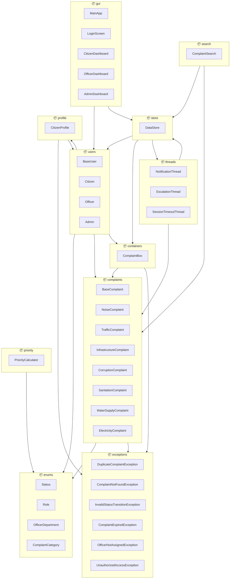

---

### 3. Component Diagram

> Shows runtime components and how they communicate.

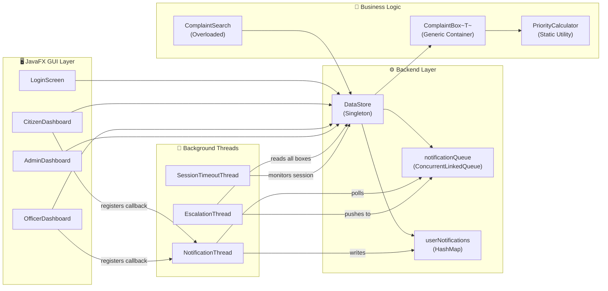

---

### 4. Object Diagram

> A snapshot of real objects in memory during a typical session.

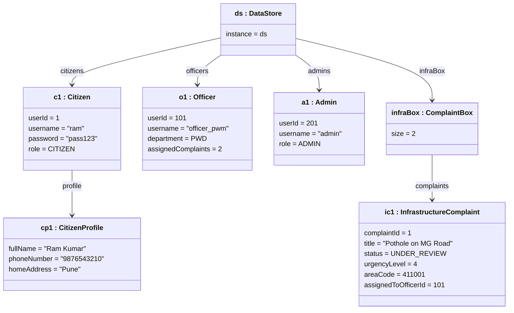

---

## 🎭 BEHAVIORAL DIAGRAMS

---

### 5. Use Case Diagram

> Shows what each actor (Citizen, Officer, Admin) can do in the system.

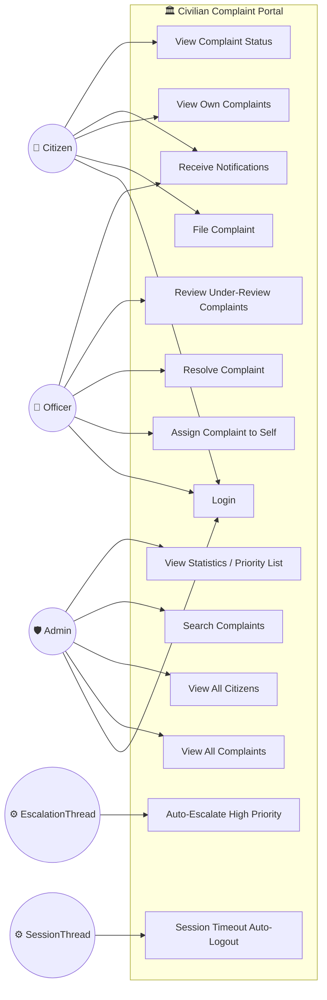

---

### 6. Sequence Diagram — Login Flow

> Shows the message flow when a user logs in.

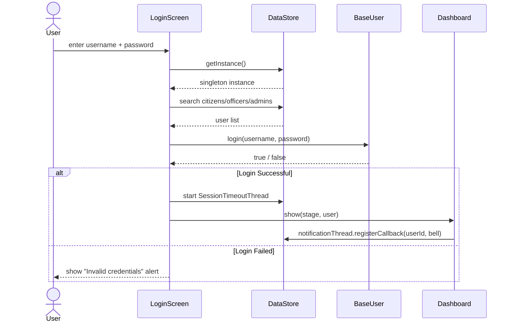

---

### 7. Sequence Diagram — File a Complaint

> Shows flow from citizen clicking "File Complaint" to saving in DataStore.

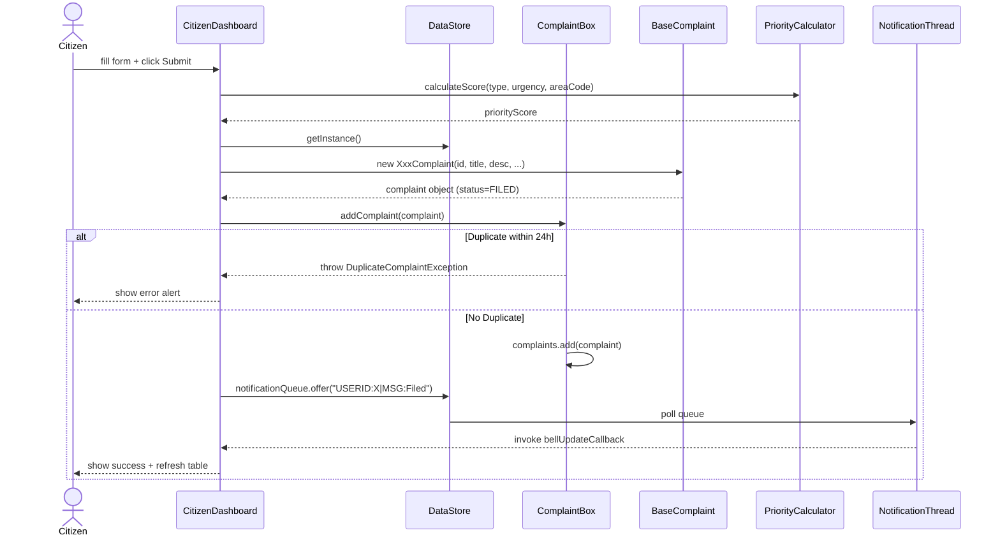

---

### 8. Sequence Diagram — Officer Resolves a Complaint

> Shows the status state machine validation during resolution.

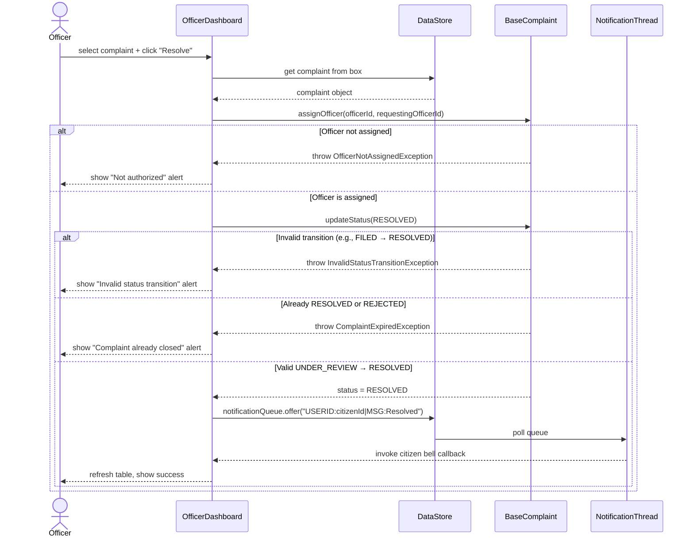

---

### 9. Sequence Diagram — Auto-Escalation (Background)

> Shows how EscalationThread works independently every 10 seconds.

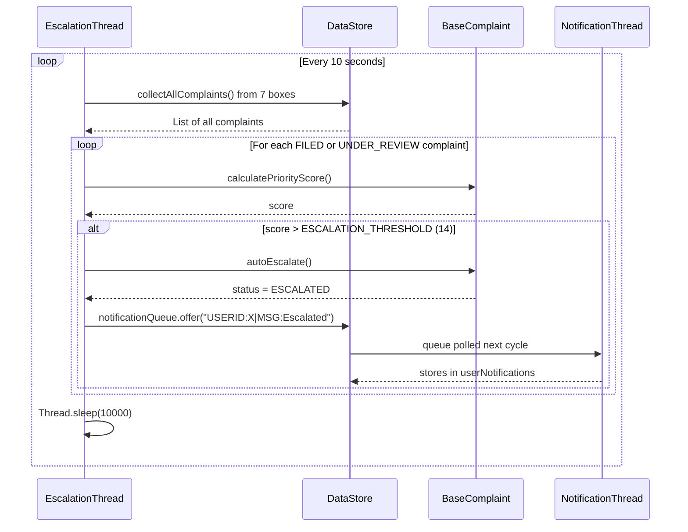

---

### 10. Activity Diagram — Complaint Lifecycle

> Shows the full journey of a complaint from filing to closure.

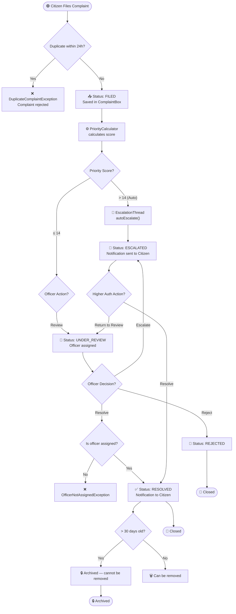

---

### 11. State Machine Diagram — Complaint Status

> Shows all valid and invalid transitions for a complaint's Status.

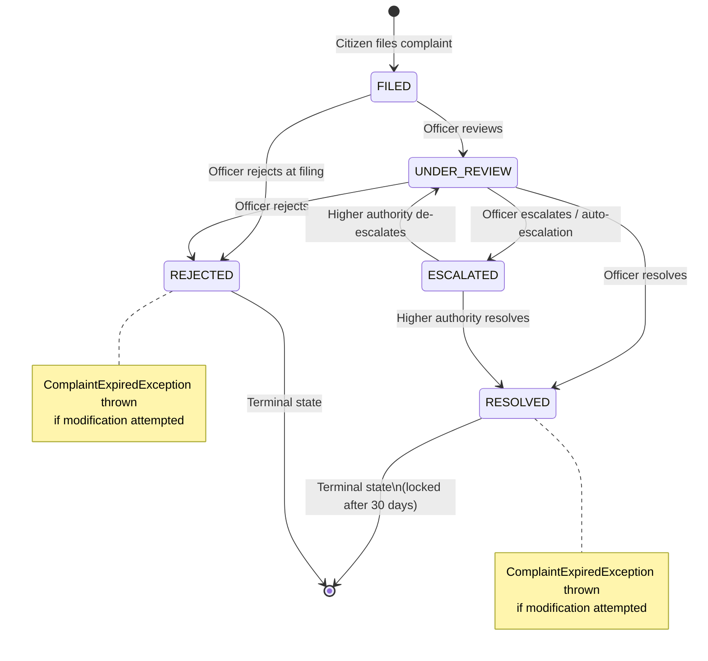

---

### 12. Collaboration (Communication) Diagram

> Shows which objects communicate with each other and the nature of the relationship.

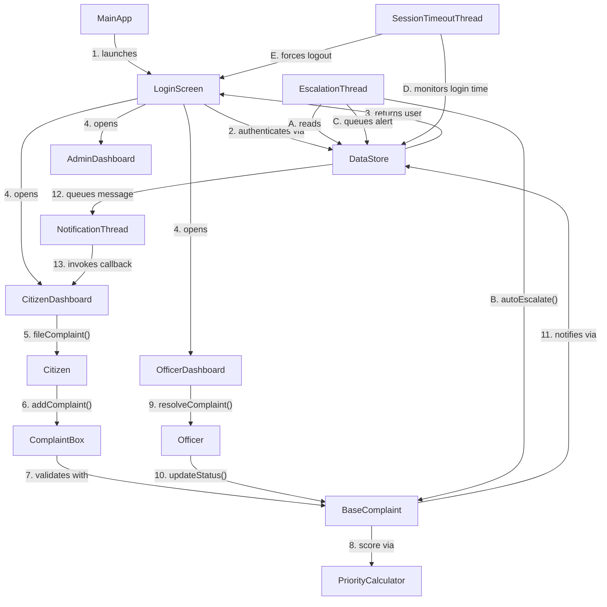

---

## 📋 Summary Table

| # | Diagram Type | Category | What It Shows |
|---|---|---|---|
| 1 | **Class Diagram** | Structural | All classes, fields, methods, inheritance, generics |
| 2 | **Package Diagram** | Structural | 11 packages + inter-package dependencies |
| 3 | **Component Diagram** | Structural | Runtime components (GUI, Backend, Threads, Logic) |
| 4 | **Object Diagram** | Structural | Snapshot of real objects during a session |
| 5 | **Use Case Diagram** | Behavioral | What Citizen / Officer / Admin can do |
| 6 | **Sequence: Login** | Behavioral | Login authentication message flow |
| 7 | **Sequence: File Complaint** | Behavioral | Filing + duplicate check + notification |
| 8 | **Sequence: Resolve** | Behavioral | Officer resolving with full exception handling |
| 9 | **Sequence: Auto-Escalation** | Behavioral | EscalationThread background loop |
| 10 | **Activity Diagram** | Behavioral | Full complaint lifecycle end-to-end |
| 11 | **State Machine** | Behavioral | Valid/invalid Status transitions |
| 12 | **Collaboration Diagram** | Behavioral | Object communication map |

---

## 🎯 OOP Concepts Mapped to Diagrams

| OOP Concept | Seen In |
|---|---|
| **Inheritance** | Class Diagram → BaseUser ← Citizen/Officer/Admin; BaseComplaint ← 7 subclasses |
| **Polymorphism** | Class Diagram → `calculatePriorityScore()` overridden in each complaint; `performAction()` overridden |
| **Encapsulation** | Class Diagram → `CitizenProfile` private fields; `ComplaintBox` private list |
| **Abstraction** | Class Diagram → `BaseUser`, `BaseComplaint` are abstract |
| **Generics** | Class Diagram → `ComplaintBox<T extends BaseComplaint>` |
| **Method Overloading** | Class Diagram → `search(int)`, `search(String)`, `search(ComplaintCategory)` |
| **Multithreading** | Component, Sequence, Collaboration → `NotificationThread`, `EscalationThread`, `SessionTimeoutThread` |
| **Exception Handling** | Sequence Diagrams (Login, Resolve, File) → 6 custom exceptions thrown and caught |
| **Singleton Pattern** | Class + Component → `DataStore.getInstance()` |
